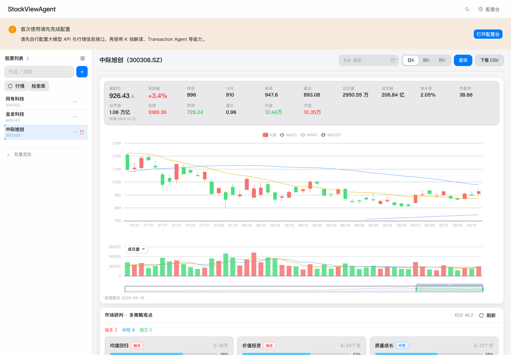
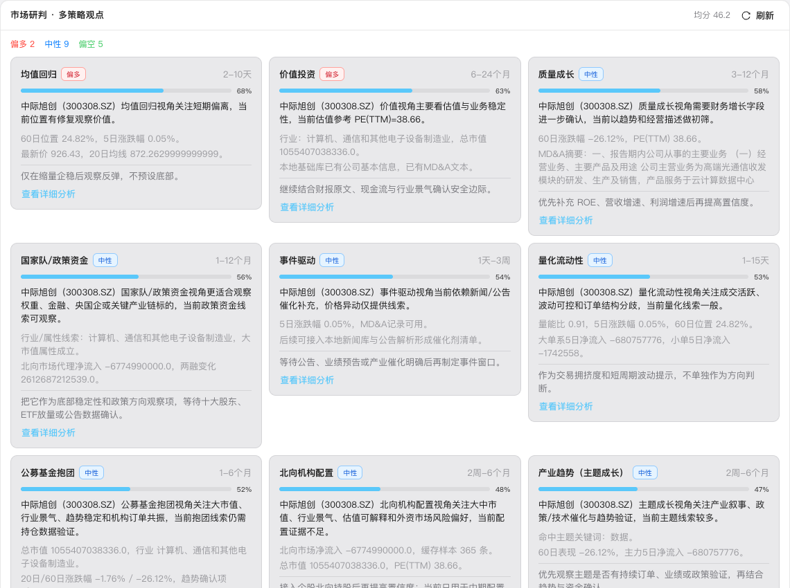
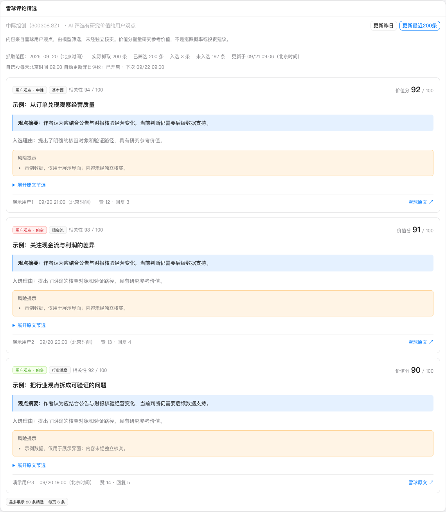

# StockViewAgent

本地运行的 **A 股单股多策略走势观点 Agent**：选一只股票、一个时间节点，在同一页查看 K 线、多策略观点、相关新闻解读、雪球评论精选和公司信息。

默认 **不必登录**（`AUTH_REQUIRED=false`），适合克隆到本机自托管。所有结论仅供研究参考，**不构成投资建议**。

## 界面预览

无需 Fork、克隆或安装，打开仓库首页即可查看下面的界面截图；点击图片可查看原图。行情和策略截图为功能展示时的页面，不代表实时行情。

### 单股行情工作台

左侧管理自选股，右侧查看 K 线、均线、成交量和行情指标，支持日 K、周 K、月 K 切换。

[](docs/images/overview.png)

### 多策略观点

并列比较价值投资、质量成长、事件驱动等研究视角，查看各策略的方向、分析依据、观察周期和风险提示。

[](docs/images/strategies.png)

### 雪球评论精选

位于新闻解读之后，展示模型筛选后的观点摘要、入选理由、风险提示和原文入口，可切换抓取最近 200 条或昨日讨论。

**下图使用演示数据，仅用于展示界面，不是真实雪球评论或模型结论。**

[](docs/images/xueqiu-comments-demo.png)

## 快速开始

需要 **Python 3.11–3.13** 与 **Node.js 20+**（不要用 Python 3.14）。

```bash
git clone https://github.com/fxfxfx99/StockViewAgent.git
cd StockViewAgent
./start.sh
```

打开 <http://127.0.0.1:5175/>，按提示进入 **配置台**（或 `/setup`）：

1. 大模型 API（OpenAI 兼容的 Key / Base / Model）
2. 行情接口：推荐 [KlineShare](https://data.klineshare.cn/docs)，或 Tushare / 仅公开源

更完整的步骤、端口、Docker 与排错见 **[docs/LOCAL_SETUP.md](docs/LOCAL_SETUP.md)**。

```bash
./scripts/check-env.sh   # 检查本机环境；未就绪时返回非零状态
./scripts/setup.sh       # 只安装依赖
./scripts/dev.sh         # 只启动
```

健康检查：<http://127.0.0.1:8001/api/health>  
OpenAPI：<http://127.0.0.1:8001/docs>

默认端口：后端 `8001`，前端 `5175`。占用时可 `BACKEND_PORT=8010 FRONTEND_PORT=5180 ./start.sh`。
`start.sh` 会按依赖文件检查是否需要安装，更新代码后也可直接运行；前后端都通过就绪检查才报告启动成功，按 `Ctrl+C` 同时停止两个服务。

## 界面做什么

单页纵向浏览，URL 深链 `?chart=600519.SS&as_of=2026-09-01`：

- 股票列表（可检索、导入）
- K 线
- 多策略观点（Transaction Agent）
- 相关新闻解读（更新新闻 / 补充分析）
- 雪球评论精选（最近 200 条讨论由大模型筛选，自选股每日北京时间 09:00 更新昨日内容）
- 公司信息

后端还提供量化、宏观、信号复盘等 API，供脚本与 Agent 调用，见 [docs/DATA_SOURCES.md](docs/DATA_SOURCES.md)。

雪球评论精选默认 **自动获取雪球访客 Cookie**，无需先手动复制：后台访问雪球首页建立匿名会话，在内存缓存 15 分钟，到期后下次抓取时重新获取。当前账户配置好大模型 API 后，首次查看尚未处理的标的会自动抓取，也可手动选择「更新最近200条」或「更新昨日」。若雪球要求账号登录或验证码，仍需人工完成；可在管理员配置台填写有效 Cookie，手动配置优先于自动会话。

自选股定时更新要求服务持续运行，且 `ENABLE_SCHEDULER=true`、`XUEQIU_COMMENTS_AUTO_REFRESH_ENABLED=true`；9 点后启动会补跑当天的昨日任务。筛选结果按账户隔离，最多展示 20 条，并保留原文入口。详细规则与接口见 [雪球评论说明](backend/docs/XUEQIU_OPTIONAL.md#雪球评论精选)。

## 配置与密钥

优先在浏览器 **配置台** 填写（写入 `backend/data/`，已忽略出版本库）。也可以编辑 `backend/.env`（从 `backend/.env.example` 复制）。

公网部署请设置 `AUTH_REQUIRED=true`，并修改 JWT 密钥与初始密码。

浏览器默认只允许 localhost / loopback 来源。局域网或部署域名需设置 `CORS_ALLOWED_ORIGINS`，例如 `FRONTEND_HOST=0.0.0.0 CORS_ALLOWED_ORIGINS=http://192.168.1.20:5175 ./start.sh`（替换为本机实际 IP）；支持逗号分隔的多个完整来源，并将这些主机加入请求 Host 白名单。可信主机上的 CLI / Agent 无 `Origin` 请求保持可用，详见[本机配置](docs/LOCAL_SETUP.md)。股票列表刷新与重建需管理员权限，本地免登录模式仍使用默认管理员。

**不要提交** `backend/.env`、`frontend/.env`、`backend/data/`。`./scripts/setup.sh` 会生成随机 `AUTH_JWT_SECRET`。

## Docker

```bash
cp backend/.env.example backend/.env
docker compose up -d --build
```

入口默认 <http://127.0.0.1:8080/>。详见 [docs/LOCAL_SETUP.md](docs/LOCAL_SETUP.md#docker)。

## 开发

开发约定与贡献流程见 [CONTRIBUTING.md](CONTRIBUTING.md)。

```bash
(cd backend && .venv/bin/python -m pytest tests/ -q)
(cd frontend && npm test && npm run build)
```

## 许可

见 [LICENSE](LICENSE)。
